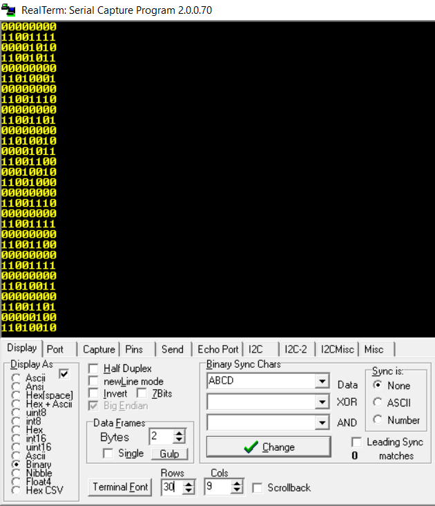

USART2 TX [PA2] ST Link 

Read ADC1 INP5 & INP6 in continuous mode, copy the results to SRAM using the DMA1 controller channel 1. Use DMA1 channel 7 to copy the SRAM data to USART2 TX and send the data to your PC over ST Link. It has to convert a 16-bit value to 8-bit. 

Use [realterm](https://sourceforge.net/projects/realterm/) or some other serial capture program to send data to the microcontroller. 

Settings: 9600 baud, 8-bit, 1 stop bit, parity: none.

