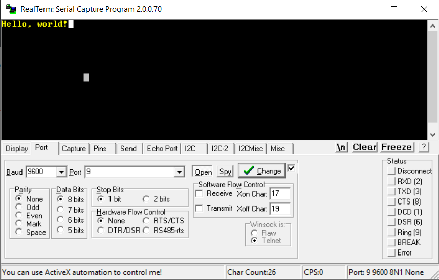

USART2 TX [PA2] and RX [PA3] ST Link 

Create an interrupt service routine that is triggered when the RX buffer is changed. The RX buffer is copied to the TX buffer. The program sends the data back over the TX line and waits until the transmission is complete. 

Use [realterm](https://sourceforge.net/projects/realterm/) or some other serial capture program to send data to the microcontroller. 

Settings: 9600 baud, 8-bit, 1 stop bit, parity: none.

