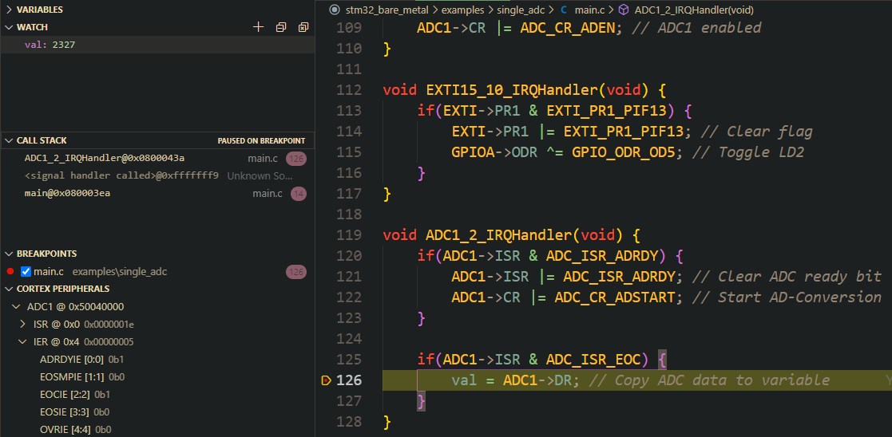

Single channel AD-Conversion using the CPU to transfer data to SRAM. PA0 is configured as ADC1 INP5. The AD-Conversion repeats forever because continuous mode is enabled.

The resolution is 12-bits, so the conversion range is equal to: [0, 4095] = [0V, 3.3V]

