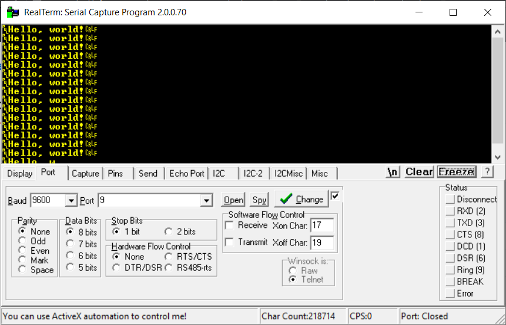

USART2 TX [PA2] and RX [PA3] ST Link 

Send data over UART using the DMA controller to copy the buffer to the TX register. 

Use [realterm](https://sourceforge.net/projects/realterm/) or some other serial capture program to send data to the microcontroller. 

Settings: 9600 baud, 8-bit, 1 stop bit, parity: none.

